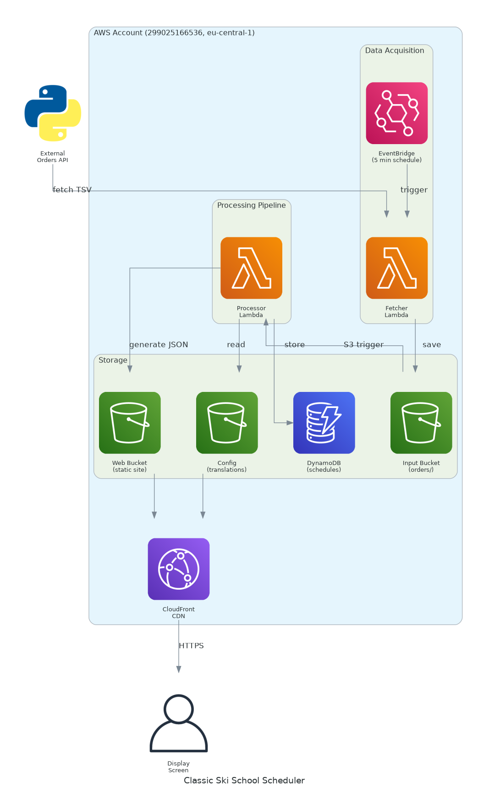

# Architecture Documentation

## Diagram



## Overview

The Classic Ski School Scheduler is a serverless AWS application that:
1. **Fetches** lesson data from external booking system (every 5 minutes)
2. **Processes** ALL lessons (~3 weeks) through pipeline (parse, validate, privacy filter)
3. **Generates** schedule.json with all dates (frontend reads this directly)
4. **Displays** lessons on vertical screens via CloudFront

## Components

| Component | AWS Resource | Purpose |
|-----------|--------------|---------|
| EventBridge | Scheduled rule (5 min) | Triggers data fetch |
| Fetcher Lambda | `goldsport-scheduler-fetcher-dev` | Fetches TSV from external API (~3 weeks of bookings) |
| Input Bucket | `goldsport-scheduler-input-dev` | Stores raw TSV files |
| Processor Lambda | `goldsport-scheduler-engine-dev` | Processes ALL lessons, regenerates schedule.json |
| DynamoDB | `goldsport-scheduler-data-dev` | **Backup storage (currently unused by frontend)** |
| Web Bucket | `goldsport-scheduler-web-dev` | Hosts static site + schedule.json |
| CloudFront | Distribution | HTTPS delivery, caching |

## Data Flow

```
External API ──(~3 weeks TSV)──> Fetcher Lambda ──> S3 Input
                                                      │
                                                      ▼ (S3 trigger)
                                              Processor Lambda
                                              (regenerates ALL)
                                                      │
                              ┌────────────────┬──────┴──────┐
                              ▼                ▼              ▼
                          DynamoDB      schedule.json     S3 Web
                          (backup)      (all dates)    (static site)
                                              │
                                              ▼
                                         CloudFront
                                              │
                                              ▼
                                           Display
```

## Key Points

- **Processor regenerates ALL schedules** each run (not just today)
- **schedule.json** contains `all_lessons_by_date` with every date from TSV
- **DynamoDB** is backup storage for future API use (frontend doesn't query it)
- **Frontend** reads schedule.json directly via CloudFront

## Regenerating

To regenerate the diagram:
```bash
python3 docs/architecture/generate.py
```

Requirements:
- `pip3 install diagrams`
- `apt-get install graphviz`
